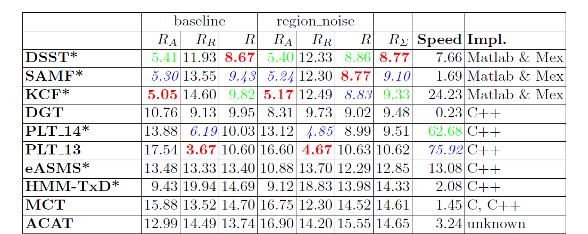

---

layout: blog
comments: true
title: 相关滤波器(Correlation Filters)
summary: 相关滤波器是最近几年在机器视觉的目标跟踪领域比较热门的技术。它将目标跟踪的识别和搜索过程转换到频域完成，取得了非常好的效果。VOT 2014的冠军算法就是通过相关滤波器实现的。本篇短文主要梳理相关滤波器的历史发展及其基本原理。
---

##介绍

在开始介绍相关滤波之前，我们先看看[VOT 2014](http://www.votchallenge.net/vot2014/index.html)前十名的算法：

Figure 1. VOT 2014前十名。

其中排在前三位的算法DSST，SAMF(多种方法的整合，无对应的公开发表论文)，KCF都是基于相关滤波的。从排名我们可以看出相关滤波在目标追踪领域有着非常出彩的效果。那么到底什么是相关滤波呢？对此我们按照相关滤波的历史发展过程进行讲解。

##原理

##总结

##引用


