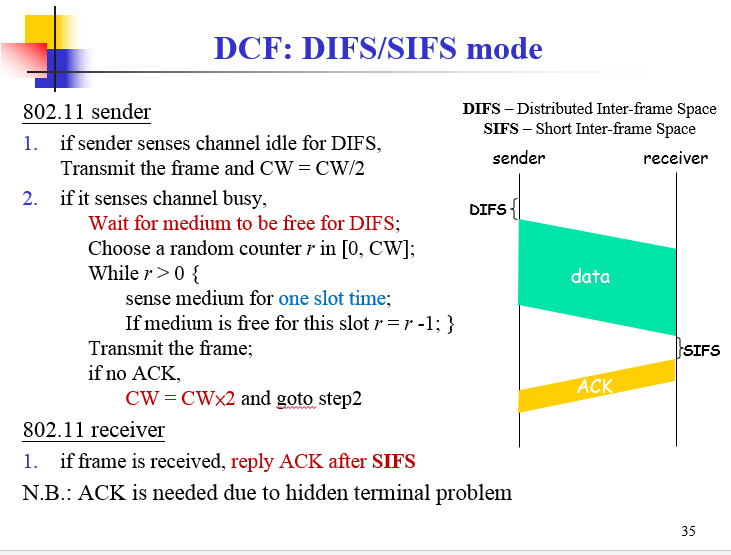

>基于[贾小华](http://www.cs.cityu.edu.hk/~jia)老师的课件整理。

##I. Introduction 

###1. Mobile Computing

Mobile computing starts from late 1990s due to the development of wireless communication and mobile devices

`Mobile Computing = Mobile + Computation`

`wireless ≠ mobile (cordless phone ≠ mobile phone)`

Mobile communication only provides connectivity between distributed entities (mobile units – mobile servers).Mobile communication requires integration of wireless networks into existing fixed networks(`WLAN`, `Internet`,
 `Cellular networks` ).In addition to communication, we also need to support mobile applications. There are three basic components:

`Networks`: mobile/wireless networks + wired networks (connectivity, QoS, …)

`Devices and computing units`: usually with limited resources, i.e., CPU power, memory, battery power, …

`Application software`: mobile apps, mobile data access, …)

###2.  Mobile Services

There are three kinds of mobile services:

`Location-based services`:Services that depend on the locations of the users, such as shopping malls, gas stations, toilets, …

`Context-aware services`:Services that depend on the context detected in the system

`Surveillance and event triggering services`:Detecting system status (e.g. intruders, crisis, …);Emergency events that require timely responses

##II. Internet Protocols

`IP`:IP实现两个基本功能：寻址和分段。IP可以根据数据报报头中包括的目的地址将数据报传送到目的地址，在此过程中IP负责选择传送的道路，这种选择道路称为路由功能。如果有些网络内只能传送小数据报，IP可以将数据报`重新组装`并在报头域内注明。IP模块中包括这些基本功能，这些模块存在于网络中的每台主机和网关上，而且这些模块（特别在网关上）有路由选择和其它服务功能。对IP来说，数据报之间没有什么联系，对IP不好说什么连接或逻辑链路。

IP使用四个关键技术提供服务：`服务类型`，`生存时间`，`选项`和`报头校验码`。服务类型指希望得到的服务质量。服务类型是一个参数集，这些参数是Internet能够提供服务的代表。这种服务类型由网关使用，用于在特定的网络，或是用于下下一个要经过的网络，或是下一个要对这个数据报进行路由的网关上选择实际的传送参数。生存时间是数据报可以生存的时间上限。它由发送者设置，由经过路由的地方处理。如果未到达时生存时间为零，抛弃此数据报。对于控制函数来说选项是重要的，但对于通常的通信来说它没有存在的必要。选项包括时间戳，安全和特殊路由。报头校验码保证数据的正确传输。如果校验出错，抛弃整个数据报。

`ICMP`:ICMP是（Internet Control Message Protocol）Internet控制报文协议。它是TCP/IP协议族的一个子协议，用于在IP主机、路由器之间传递控制消息。控制消息是指网络通不通、主机是否可达、路由是否可用等网络本身的消息。这些控制消息虽然并不传输用户数据，但是对于用户数据的传递起着重要的作用。

`IGMP`:Internet 组管理协议称为IGMP协议（Internet Group Management Protocol），是因特网协议家族中的一个组播协议。该协议运行在主机和组播路由器之间。IGMP协议共有三个版本，即IGMPv1、v2 和v3。

##III. Wireless Communication Fundamentals

###1. Multiplexing Techniques

`Frequency-division multiplexing (FDM)`:Takes advantage of the fact that the useful bandwidth of the medium exceeds the required bandwidth of a given signal

`Time-division multiplexing (TDM)`:Takes advantage of the fact that the achievable bit rate of the medium exceeds the required data rate of a digital signal

`Code-division multiplexing (CDM)`:Each sender uses a unique random number (code) and XORs the signal with this random number.
 `码分多路复用`CDM又称`码分多址（Code Division Multiple Access ,CDMA）`,它既共享信道的频率,也共享时间,是一种真正的动态复用技术.其原理是每比特时间被分成m个更短的时间槽，称为芯片（Chip）,通常情况下每比特有64或128个芯片.每个站点(通道)被指定一个唯一的m位的代码或芯片序列。当发送1时站点就发送芯片序列，发送0时就发送芯片序列的反码。当两个或多个站点同时发送时，各路数据在信道中被线形相加。为了从信道中分离出各路信号，要求各个站点的芯片序列是相互正交的.

CDMA的优点：`All terminals can use the same frequency, no planning needed Huge code space (e.g. 232) compared to frequency space;Interferences is not coded `

##IV. Cellular System Fundamentals

###1. Overview of Telecommunication(无线通信) Systems

`1G`: Basic mobile telephony service.Based on `analog` cellular technology.i.e.,  American Mobile Phone (AMPS) and NMT in Europe

`2G`: mobile telephony services for mass users with improved ciphering and efficient utilization of the radio spectrum
`Digital` cellular technology.i.e., GSM and CDMA

`2.5G`: Mobile Internet/data services together with voice services.Packet switching technology adding into 2G.Providing mobile data services over 2G networks.i.e., GPRS (General Packet Radio Service) and EDGE

`3G`: enhanced 2.5G services with improved mobile internet services and emerging new applications.CDMA2000 and UMTS (Universal Mobile Telecommunication System)

`4G (LTE/WiMAX)` and `XG`: what will be the next? IP-based mobile networks?

###2. Cellular Networks

蜂窝网络或移动网络(Cellular network)是一种移动通信硬件架构，把移动电话的服务区分为一个个正六边形的小子区，每个小区设一个基站，形成了形状酷似“蜂窝”的结构，因而把这种移动通信方式称为蜂窝移动通信方式。

蜂窝网络被广泛采用的原因是源于一个数学结论，即:
`相同半径的圆形覆盖平面当圆心处于正六边形网格的各正六边形中心，也就是当圆心处于正三角网格的格点时所用圆的数量最少`。

 虽然使用最少个结点可以覆盖最大面积的图形即使要求结点在一个如同晶格般有平移特性的网格上也仍是有待求解的未知问题，但在通讯中，使用圆形来表述实践要求通常是合理的，因此出于节约设备构建成本的考虑，正三角网格或者也称为简单六角网格是最好的选择。这样形成的网络覆盖在一起，形状非常象蜂窝，因此被称作蜂窝网络。

 蜂窝网络的优缺点：

优点：

`Higher capacity(更高的频率容量)`: implementing space division multiplexing to allow frequency reuses to support higher bandwidth and more users

`Less transmission power（更小的传输能量）`: MSs are not far away from BSs. The power consumption of mobile device is minimized 

`Local interference（局部干扰少）`: shorter distance between MS and BS leads to low transmission power => less interference

`Robustness（容错率高）`: Decentralized system with multiple BSs for connection with MSs => more fault tolerant 

缺点：

`Infrastructure`: require a complex infrastructure to have full coverage of the whole service area and onnect all base stations

`Handoff`: moving from one cell into another 

`Umbrella cell (hierarchical cell)`:

Two (or more) levels: macro cell over multiple micro-cells

To reduce number of handoffs for fast moving users (in vehicles)

A tradeoff solution for channel reuse and the frequent handoffs

####A. 蜂窝信道分配

`FDMA系统`：利用信号衰减原理。关键：将频谱划分为若干个信道(用户信道载波)，在距离足够远时可以复用信道。

`静态信道分配`：每一蜂窝预先分配一组固定的信道，实现简单。

`动态信道分配`：基站从MSC处动态分配一个信道，蜂窝可以使用所有的信道，降低了阻塞概率，实现复杂，需要实时流量检测和基站间的协调处理。

###2. SIR的计算

$$
\frac{S}{I} = \frac{1}{6}(\frac{D}{R})^{\alpha}
$$

##V. Cellular Networks in Operations

###1.  Cellular System Infrastructure

##VI. Wireless LANs IEEE 802.11 (Wi-Fi)

###1. Wireless Local Area Network (LAN) basis

`Wireless Local Area Network (WLAN)` provide access to wired `LANs` and the `Internet`.Which in a very local area,less than 100 meters;and provide high data rates,, up to 54 Mbps currently.

WLANs 的两种模式:`Infrastructure Mode(eg.WiFi)` 和 `Ad Hoc Mode（eg.蓝牙）`.Infrastructure 模式中，所有无线的host都连接到一个access point，由access point 负责无线网络和有线网络的通信。Ad Hoc 模式中不存在access point，各个host点对点通信。

一个MS如何加入一个LWANs呢？

分成四步：

`Discover available networks`

`Select a network`

`Authentication`

`Association (registration)`

连接建立后，如何传输数据？

`载波侦听多路访问/碰撞避免`:

`Carrier Sense Multiple Access (CSMA)`: Listen before talk
,Sense the channel
,If the channel is idle, transmit immediately
;If the channel is busy
;wait a random amount of time  (random backoff time)
;sense the channel again

`Collision Detection (CD)`: Stop if collision occurs.
;If there is a collision detected during the transmission
;stop transmission immediately 
;wait a random amount of time 
;Goto step 1 to sense the channel again

而对于`802.11`，是`没有冲突检测的!!!`替代它的是`CSMA/CA(载波监听/冲突避免)`。

`RTS/CTS协议`：即请求发送/允许发送协议，相当于一种握手协议，主要用来解决"隐藏终端"问题。"隐藏终端"（Hidden Stations）是指，基站A向基站B发送信息，基站C未侦测到A也向B发送，故A和C同时将信号发送至B，引起信号冲突，最终导致发送至B的信号都丢失了。"隐藏终端"多发生在大型单元中（一般在室外环境），这将带来效率损失，并且需要错误恢复机制。当需要传送大容量文件时，尤其需要杜绝"隐藏终端"现象的发生。IEEE802.11提供了如下解决方案。在参数配置中，若使用RTS/CTS协议，同时设置传送上限字节数----一旦待传送的数据大于此上限值时，即启动RTS/CTS握手协议：首先，A向B发送RTS信号，表明A要向B发送若干数据，B收到RTS后，向所有基站发出CTS信号，表明已准备就绪，A可以发送，而其余欲向B发送数据的基站则暂停发送；双方在成功交换RTS/CTS信号（即完成握手）后才开始真正的数据传递，保证了多个互不可见的发送站点同时向同一接收站点发送信号时，实际只能是收到接收站点回应CTS的那个站点能够进行发送，避免了冲突发生。即使有冲突发生，也只是在发送RTS时，这种情况下，由于收不到接收站点的CTS消息，大家再回头用DCF协议提供的竞争机制，分配一个随机退守定时值，等待下一次介质空闲DIFS（Distributed Inter-Frame Space）后竞争发送RTS，直到成功为止。

##VII. Wireless Mesh Networks

`Mesh`:所有节点都相连。

无线网状网络（`无线Mesh网络，或WMN/wireless mesh network`）也称为“多跳（multi-hop）”网络，它是一种与传统无线网络完全不同的新型无线网络技术。在传统的无线局域网(WLAN)中，每个客户端均通过一条与AP相连的无线链路来访问网络，用户如果要进行相互通信的话，必须首先访问一个固定的接入点(AP)，这种网络结构被称为单跳网络。而在无线Mesh网络中，任何无线设备节点都可以同时作为AP和路由器，网络中的每个节点都可以发送和接收信号，每个节点都可以与一个或者多个对等节点进行直接通信。这种结构的最大好处在于：如果最近的AP由于流量过大而导致拥塞的话，那么数据可以自动重新路由到一个通信流量较小的邻近节点进行传输。依此类推，数据包还可以根据网络的情况，继续路由到与之最近的下一个节点进行传输，直到到达最终目的地为止。这样的访问方式就是多跳访问。

##VIII. Mobile Ad Hoc Networks(MANET)

`MANET`为`Mobile Ad hoc network`的简称，Ad hoc网络是一种自组织网络，分为固定节点和移动节点两种。MANET特指节点具有移动性的Ad hoc网络。比如有N个笔记本电脑通过802.11的Ad hoc模式自己组网形成一个网络，如果笔记本的使用者不移动的话，网络的拓扑就不会改变，路由等也就是固定的。但是如果每个出租车上都配置一个无线网卡，全部出租车组成一个网络，则拓扑是不断变化的，路由等也变的复杂。

#IX. Wireless Sensor Networks

Working Modes of Sensor Networks:1)`Proactive networks`,2)`reactive networks`.

`Data Aggregation in Sensor Networks`:In traditional networks each node is identified by an IP address, which is used for routing. Sensor networks, in general, do not require routing between specific nodes.In most of sensor network applications, data can be aggregated (e.g., min, max, avg, etc) at internal node before passing it up further to the sink.Data aggregation takes a `tree structure`.

`Routing in Sensor Networks – Flat Routing`:

1)直接扩散:eg.every 20 ms for the next 10 seconds, send me a location estimate of any four-legged animal in subregion R of the sensor field.

该算法实现的过程包括三个阶段：兴趣扩散，梯度建立以及路径加强。

兴趣扩散(Interest Propagation)：Sink节点查询兴趣消息，兴趣消息采用泛洪的方法传播到网络，来通知整个网络中的其他节点它需要的信息。

梯度建立(Initial gradients set up)：在兴趣消息扩散的同时相应的路由路经也建立完成。有“兴趣消息”相关数据的普通节点将自己采集的数据通过建立好的路径传送到Sink节点。

路径加强(Data Delivery,reinforced gradients)：最后sink节点选择一条最优路径作为强化路径。

Problems of flooding protocol.

`Implosion`(内聚): A node always sends data to its neighbors even if the same data has been received by the neighbors from other nodes.

`Overlap`（重叠）: The nodes waste energy and bandwidth by sending the overlapping data.

`Resource` Blindness: Nodes do not change activities based on the energy availability.

2)`Sensor Protocols for Information via Negotiation` :

`Negotiation` : communicate with each other about the sensor data already received and the data still needed, via meta-data messages.

Data ADV (advertisement) is broadcast throughout the network;

Anybody interested in the data sends a REQ to the data source ;

No data aggregation is considered in both Directed Diffusion and SPIN;

SPIN-1:

`Hierarchical Routing in Sensor Networks`:

* Hierarchical clustering schemes are the most suitable for wireless sensor networks.

* The network hass of a Base Station (BS) through which the end user can access data from the sensor network.

* BS can transmit with high power.

* Nodes cannot reply directly to the BS due to their low power constraints, resulting in `asymmetric communication`

`Low Energy Adaptive Clustering Hierarchy ("LEACH")` is a `TDMA-based MAC protocol` which is integrated with clustering and a simple routing protocol in wireless sensor networks (WSNs). The goal of LEACH is to lower the energy consumption required to create and maintain clusters in order to improve the life time of a wireless sensor network.

该算法基本思想是：以循环的方式随机选择`簇头节点`，将整个网络的能量负载平均分配到每个传感器节点中，从而达到降低网络能源消耗、提高网络整体生存时间的目的。仿真表明，与一般的平面多跳路由协议和静态分层算法相比，LEACH分簇协议可以将网络生命周期延长15%。

##X. Vehicular Ad Hoc Networks

`What are vehicular networks? `:A vehicle in the near future will be an integrated system with on-board sensors, computers and communication devices on wheels.
`Why vehicular networks?`:Fast and Direct Communication;Low cost;
`Characteristics of VANETs`:

Highly dynamic topology

Frequently disconnected network

Sufficient energy and storage

Geographical type of communication

`Routing in VANETs`

`Ad hoc routing`

`Prediction-based AODV`:Predict link lifetimes using the speed and location information of nodes

Position-based routing

`GPSR`

`GPCR`

`Cluster-based routing`

`Forming stable clustering structure`
