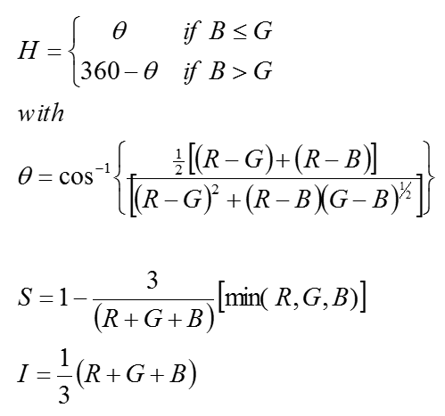

|基于[卢光明](http://cs.hitsz.edu.cn/teachers/t1/1190359289.html)老师的讲义整理，以问题的形式回顾本课程的重点。

##I. 什么是霍夫变换？简述其过程。

Calculating steps of hough transform:

1. In parameter space, quantize $a$ and $b$, and give out 
($a_{min}$).
2. Set an accumulator A: A is A(amin:amax, bmin:bmax),set A to zero at the beginning.
3. For a given point (xi,yi) in the original space, let a equal to each allowed values on the a-axis, and solve for the corresponding b using the equation: 
4. The resulting b are then rounded off to the nearest allowed value in the b-axis. If a choice of ap results in solution bq, we let A(p,q)=A(p,q)+1
At the end of this procedure, a value Q in $A_{(i,j)}$ corresponds to Q points in the xy space lying on the line y=aix+bj.

##II. 列出三种颜色模型，简述其基本组成。

`GRB模型`:最简单的颜色模型，以三维数组存放Red,Green,Blue的颜色值。

`HSI模型`:反映了人的视觉系统感知彩色的方式，以`色调`、`饱和度`和`强度`三种基本特征量来感知颜色。

`YUV模型`:用于电视显示的颜色模型。Y表示亮度，$U = \frac{Red}{Green}$,$Q =  \frac{Blue}{Yellow}$。单独列出亮度信号是方便兼容黑白电视。

##III. 压缩率和冗余

Data redundancy is the central issue in digital image compression.

If $n1$ and $n2$ denote the number of information-carrying units in two data sets that represent the same information

The relative data redundancy $RD$ of the first data set can be defined as:

$$
RD = 1 −1/CR
$$

where compression ratio $CR$ is

$$
CR =n1/n2
$$

##IV. 什么是 inverse filtering ? 简述图像复原模型。

The degradation process is modeled as a degradation function that together with an additive noise term.

$$
g(x,y) = h(x,y) * f(x,y) + \eta(x,y)
$$

In frequency domain representation:

$$
G(u,v) = H(u,v)F(u,v) + N(u,v)
$$

Where: $f(x,y)$ is the input image, $g(x,y)$ is the degraded image, $h(x,y)$ is the degradation function, and $\eta(x,y)$ is the additive noise.The degradation model is as shown following figure:

And the restoration model is:

From the equation above:

$$
\bar{F}(u,v) = \frac{G(u,v)}{H(u,v)} = F(u,v) + \frac{N(u,v)}{H(u,v)}
$$

It tells us that even if we know the degradation function we cannot recover the undegraded image. Because $N(u,v)$ is a random function whose Fourier transform is not known.