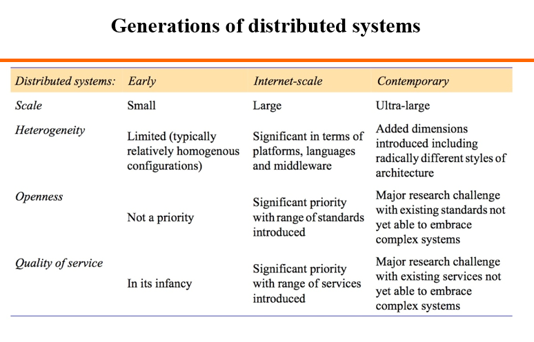

>注：基于[堵宏伟](http://www.hitsz.edu.cn/body/shizi/detailcn.php?strID=604)老师的课件整理。

##Chapter 1.Introduction

`Keywords:resource sharing,collaborative computing,concurrency,no global clock,independent failure`

###The motivation of distributed system:

* Resourse Sharing

    including :hardware sharing,software sharing,data sharing,service sharing,and media stream sharing.

* Collaborative Computing

    parallel computing,distributed computing.

`Definition:A distributed system is defined as one in which components at networked computers communicate and 
coordinate their actions only by passing messages.`

`Middleware` is the core layer of distriubuted system.

###3 features of distributed system:

`Concurrency`:multi-process and multi-threads concurrently executing ,sharing resources.

`No gobal clock`:program coordination(程序间的协调工作) depend on massage passing.

`independent failure`:some processes failure,can not known by other processes.

###some typical distributed systems

* DNS service[?](http://linux.vbird.org/linux_server/0350dns.php#Whatisdns)

* distributed file system(eg.[Hadoop](http://hadoop.apache.org/docs/r1.0.4/cn/hdfs_design.html))

* GPS

###Question 1

>List the three main software components that may fail when a client process invokes a method in a server object, giving an example of a failure in each case. To what extent are these failures independent of one another? Suggest how the components can be made to tolerate one another’s failures

The three main software components that may fail are:

* the client process e.g. it may crash
* the server process e.g. the process may crash
* the communication software e.g. a message may fail to arrive

The failures are generally caused independently of one another. Examples of dependent failures:

* if the loss of a message causes the client or server process to crash. (The crashing of a server would cause a client to perceive that a reply message is missing and might indirectly cause it to fail). 
* if clients crashing cause servers problems. 
* if the crash of a process causes a failures in the communication software.

Both processes should be able to tolerate missing messages. The client must tolerate a missing reply message after it has sent an invocation request message. Instead of making the user wait forever for the reply, a client process could use a timeout and then tell the user it has not been able to contact the server. 

A simple server just waits for request messages, executes invocations and sends replies. It should be absolutely immune to lost messages. But if a server stores information about its clients it might eventually fail if clients crash without informing the server (so that it can remove redundant information). (See stateless servers in chapter 4/5/8).

The communication software should be designed to tolerate crashes in the communicating processes. For example, the failure of one process should not cause problems in the communication between the surviving processes. 

##Chapter 2.Distributed Systems models

###physical model

Physical model describe distributed system  explicitly.It capture `hardware composition` in terms of computers and their `inter-connnecting networks`.

The baseline physical model:

* Hardware and software components located at networked computers communicate and coordinate their actions by passing messages.
*  Very simple physical model of a distributed system.

###architectural model

This model describe systems in terms of computational and communication task performed by computational elements.An architectural model of a distributed system simplifies and abstracts the functions of the individual components of a distributed system and 1)Organization of components across the network of computers.2)Their interrelationship, i.e., communicate with each other.

###Architectural elements

* communicating entities are tpyically processes.

####

###fundamental model

Including interaction model,failure model,and the security model. 

##Distributed Time and Clock Synchronization

##Socket Communication

##Remote Method Invocation(RMI)

##Group Communication

##Mutual exclusion & election algorithms

##Replication