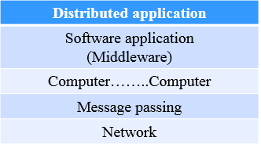
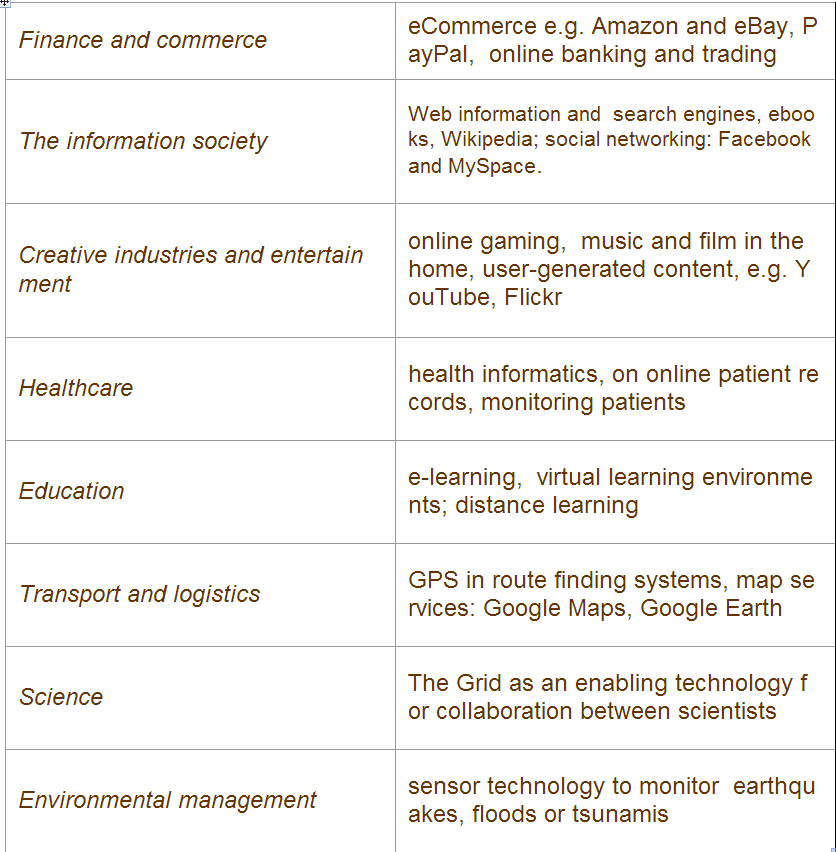

>注：基于[堵宏伟](http://www.hitsz.edu.cn/body/shizi/detailcn.php?strID=604)老师的课件整理。

###Introduction

The motivation of distributed system:

* Resourse Sharing

    including :hardware sharing,software sharing,data sharing,service sharing,and media stream sharing.

* Collaborative Computing

    parallel computing,distributed computing.

`Definition:A distributed system is defined as one in which components at networked computers communicate and 
coordinate their actions only by passing messages.`

`Middleware` is the core layer of distriubuted system.

###Distributed Systems models

###Distributed Time and Clock Synchronization

###Socket Communication

###Remote Method Invocation(RMI)

###Group Communication

###Mutual exclusion & election algorithms

###Replication