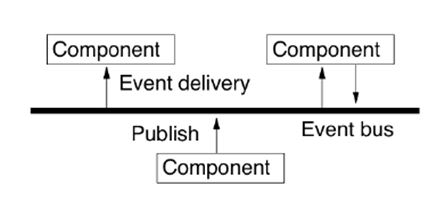
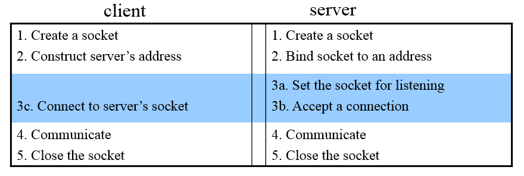

>注：基于[堵宏伟](http://www.hitsz.edu.cn/body/shizi/detailcn.php?strID=604)老师和[贾小华](http://www.cs.cityu.edu.hk/~jia/cs6223/cs6223.html)老师的课件整理。

##Chapter 1.Introduction

`Keywords:resource sharing,collaborative computing,concurrency,no global clock,independent failure`

###The motivation of distributed system:

* Resourse Sharing

    including :hardware sharing,software sharing,data sharing,service sharing,and media stream sharing.

* Collaborative Computing

    parallel computing,distributed computing.

`Definition:A distributed system is defined as one in which components at networked computers communicate and 
coordinate their actions only by passing messages.`

`Middleware` is the core layer of distriubuted system.

###3 features of distributed system:

`Concurrency`:multi-process and multi-threads concurrently executing ,sharing resources.

`No gobal clock`:program coordination(程序间的协调工作) depend on massage passing.

`independent failure`:some processes failure,can not known by other processes.

###some typical distributed systems

* DNS service[?](http://linux.vbird.org/linux_server/0350dns.php#Whatisdns)

* distributed file system(eg.[Hadoop](http://hadoop.apache.org/docs/r1.0.4/cn/hdfs_design.html))

* GPS

###Question 1

>List the three main software components that may fail when a client process invokes a method in a server object, giving an example of a failure in each case. To what extent are these failures independent of one another? Suggest how the components can be made to tolerate one another’s failures

The three main software components that may fail are:

* the client process e.g. it may crash
* the server process e.g. the process may crash
* the communication software e.g. a message may fail to arrive

The failures are generally caused independently of one another. Examples of dependent failures:

* if the loss of a message causes the client or server process to crash. (The crashing of a server would cause a client to perceive that a reply message is missing and might indirectly cause it to fail). 
* if clients crashing cause servers problems. 
* if the crash of a process causes a failures in the communication software.

Both processes should be able to tolerate missing messages. The client must tolerate a missing reply message after it has sent an invocation request message. Instead of making the user wait forever for the reply, a client process could use a timeout and then tell the user it has not been able to contact the server. 

A simple server just waits for request messages, executes invocations and sends replies. It should be absolutely immune to lost messages. But if a server stores information about its clients it might eventually fail if clients crash without informing the server (so that it can remove redundant information). (See stateless servers in chapter 4/5/8).

The communication software should be designed to tolerate crashes in the communicating processes. For example, the failure of one process should not cause problems in the communication between the surviving processes. 

##Chapter 2.Distributed Systems models

###physical model

Physical model describe distributed system  explicitly.It capture `hardware composition` in terms of computers and their `inter-connnecting networks`.

The baseline physical model:

* Hardware and software components located at networked computers communicate and coordinate their actions by passing messages.
*  Very simple physical model of a distributed system.

###architectural model

This model describe systems in terms of computational and communication task performed by computational elements.An architectural model of a distributed system simplifies and abstracts the functions of the individual components of a distributed system and 1)Organization of components across the network of computers.2)Their interrelationship, i.e., communicate with each other.

###Architectural elements
`communicating entities`

* communicating entities are tpyically processes.
* Problem-oriented perspective

`Communicating paradigms`

* Interprocess communication (IPC)
* Remote invocation 

    Resulting in the calling of a remote operation,procedure or method.

* Indirect communication

    Group communication
    
    

    publish-subscribe-system
    
    * Communication through propagation of events
    * Generally associated with publish/subscribe systems
    * Sender process publishes events
    * Receiver process subscribes to events and receives only the ones it is interested in

    

`Roles and responsibilities`:C-S,P2P

`Placement`(布局):
    
* Services provided by multiple servers.eg.[Web servers and NIS]

* Proxy server and caches.

    A cache is a store of recently used data objects that is closer to the objects themselves. Caches might be co-located with each client or may be located in a proxy server that can be shared by several clients.

* Mobile code.eg [applets]
* Mobile agents.eg [collecting information]

`Architectural patterns`

the platform layer is indepedent in each  facility.such as,x86/Windows, intel x86/Solaris, PowerPC/Mac OS X, Intel x86/Linux

Middleware is a layer that provide a convenient programming model to application programmers.

###fundamental model

Including interaction model,failure model,and the security model. 

####Interface models

* Performance of the commnication channels:latency(分属于两个不同服务器的进程间的通信时间。) and bandwidth.

* two variants of the interavtion model:同步和异步.

####Failure models(分布式系统中的对于错误的处理。)

The failure model defines ways in which failure may occur in order to provide an understanding of the effects of failure.

####Security models

The security of a distributed system can be archived by securing the processes and the channels used for their interactions and by protecting the objects that they encapsulate against unauthorized access.

##Distributed Time and Clock Synchronization

时间的同步对于分布式系统有着重要的意义。回忆我们前面描述的关于分布式系统的三个特点：1)并发性,2)无全局时钟,3)错误独立发生.“无全局时钟”对于许多应用来说是个不小的障碍，比如服务器与客户端间的信息同步是需要知晓双方的时间戳。

###物理时间

`格林威治时间`

`International atomic time`：以物质的原子内部发射的电磁振荡频率为基准的时间计量系统。秒长定义为铯 -133 原子基态的两个超精细能级间在零磁场下跃迁辐射9192631770周所持续的时间 。

`Coordinated Universal Time (UTC)` : Based on the atomic time (TAI) and introduced from 1 Jan 1972.A leap second is occasionally inserted or deleted to keep in step with solar time when the difference btw a solar-day and a TAI-day is over 800ms

`计算机时间`:计算机时间由CMOS时钟电路的振荡器生成。

在分布式系统中当然会涉及到计算机时间与我们日常使用的标准时间(格林威治时间或者世界时间)的同步与校准问题。由于振荡电路的计数频率精度上限，计算机时间可能会快于或慢于标准时间。所以我们需要对振荡电路的计数频率做动态地调整。

而对于如何与标准时间同步，最简单的方法是直接从标准时间的相关机构获取：但传统方法(GPS,WWV,GOES)并不适合每台主机。
对于一个client,我们可以利用远程过程调用([RPC](http://baike.baidu.com/link?url=DP4b-y5hPFuokNF0uYsdGCgDOu2O7FceJvPaPIKxxrR8AKV71ButnDLMhghSyAmCPjI_I7qmy-JO74pwNGrKtZrS1DbJQfDXAKxbR3NjXsi) ）同步时钟，但是此种方法返回的时间并没有加上服务器与客户端通信的时间，当然是不准确的。

为了解决上面的问题，下面我们给出两种算法:`Cristian’s 算法`和`Berkeley 算法`。

####Cristian 算法

####Question 2

>1. A client attempts to synchronize with a time server. It records the following round trip times and timestamps returned by the server.
a)  To what time should it set its clock?  Estimate the accuracy of the setting with respect to the server’s clock.  
b)  Suppose the minimal time required for a message passing (from a sender to a receiver) in the system is 8 msec. Do your answers change?

Round trip time (msec)     time (hr:min:sec)

    22                  10:54:23.674
    25                  10:54:25.450
    20                  10:54:28.342

Solution: 

                10:54:23.685            accuracy a) ±11msec              b) ±3msec
               10:54:25.4625                             ±12.5msec               ±4.5msec
               10:54:28.352                               ±10msec                  ±2msec

####Berkeley 算法

##Sockets Communication
###Sockets
一个分布式系统可以大致上建模为服务器和客户端进程。服务器和客户端通常在不同的主机上，它们之间的交互需要通过消息传递(`Message Passing`)。服务器进程在提供服务时，需要得到一个`端口`。同样的，客户端在于服务器通信时也需要从所在的主机获取一个端口。

`传输层协议`支持不同主机进程间的通信，它分为两种:1)面向链接的协议(`TCP`);2)无链接的协议(`UDP`)。

`Sockets（套接字）`:对传输层的抽象。它支持不同的传输层协议。

一些sockets的操作：

>socket ,bind,listen, accept, connect,read/write, send/recv, sendto/recvfrom, sendmsg/recvmsg,close/shutdown

###进程间通信

####Question 3

> 1.  a)  explain the relationship between IPC and RPC.

In fact, RPC is finally implemented by IPC. RPC is a higher level application.

> b)when you use RPC package to write application programs, why do you need to have an interface definition?

Because usually the people who write server programs are different from those who write client programs. In order for these different groups to agree on something which can make the whole system work, a uniform standard must be specified for both groups. This standard is exactly the interface definition we are writing.

> c) what client & server procedures should you write and what procedures are automatically generated by the RPC compiler?

Stub and skeleton are automatically generated by the RPC compiler together with sample client and server files. But we need to modify the samples according to our needs.

>2 .  The Election Service provides two remote procedures:

>•   Vote: with two parameters through which the client supplies the name of a candidate (string) and the voter’s number (integer).

>•   Result: with one parameter of the name of a candidate and the system returns the number of votes the candidate has obtained>.

>Define the interface to the Election service in Sun XDR.

struct voteargs {
    string  name;
    int id;
};

program ELECTION {
    version VERSION {
    void    Vote(voteargs) = 1;
    int Result(string) = 2;
    } = 1;
} 13456;

##Remote Method Invocation(RMI)

##Group Communication

##Mutual exclusion & election algorithms

##Consistency and Replication

为什么需要数据冗余？

1. 提高稳定性；
2. 提高大型系统的性能。

`冗余必须是一致的(consistent)。`

* 数据的修改必须在所以副本上同时执行。
 
##Name Services

###Name, address, route

The    `name` indicates what we seek

* Human readable

* Universal Resource Names (URNs)

An `address` indicates where it is

IP address, port

A `route` tells how to get there 

Internet routing

