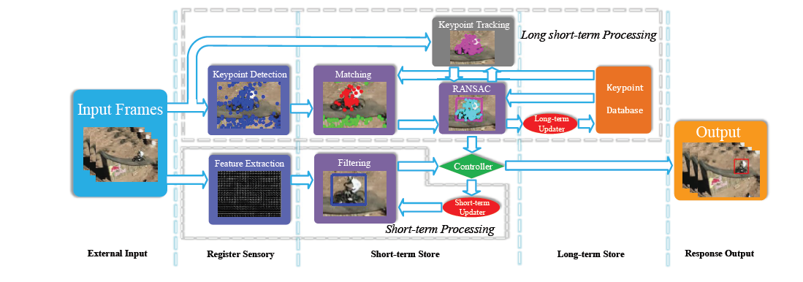

---

layout: blog
comments: true
title: 【Paper Reading】 MUlti-Store Tracker (MUSTer), a Cognitive Psychology Inspired Approach to Object Tracking
summary:  This paper propose a strategy to combine two kinds of trackers, a DSST tracker for short-term tracking, a key-point tracker for long-term.

---

>This paper propose a strategy to combine two kinds of trackers, a DSST tracker for short-term tracking, a key-point tracker for long-term. [original paper](../img/muster.pdf)

